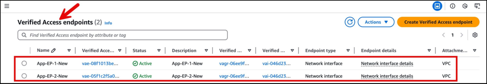

---
title: "Secure internet-based access to SaaS PrivateLink endpoints using AWS Verified Access"
date: 2025-08-21
weight: 1
chapter: false
pre: " <b> 3.1. </b> "
---

**Authors:** Salman Ahmed and Ankush Goyal | **Date:** August 21, 2025

**Categories:** [AWS PrivateLink](https://aws.amazon.com/privatelink/), [AWS Verified Access](https://aws.amazon.com/verified-access/), [Networking & Content Delivery](https://aws.amazon.com/products/networking/), [SaaS](https://aws.amazon.com/saas/), [Technical How-to](https://aws.amazon.com/blogs/networking-and-content-delivery/category/post-types/technical-how-to/)

---

## Introduction

As cloud adoption continues to grow, software-as-a-service (SaaS) providers on AWS increasingly use **Amazon Web Services (AWS) PrivateLink** to deliver services to customers securely.

PrivateLink enables private, seamless connectivity between VPCs without exposing applications to the public internet, ensuring strong security and stable network performance.

However, what if you want to provide that same level of secure access to users outside of AWS — such as remote employees or partners connecting via the internet? **AWS Verified Access** allows you to extend PrivateLink-powered services to authorized users over the internet while maintaining strict security barriers and a **zero trust** architecture.

In this post, we'll explore how to enable secure, scalable, internet-based access to PrivateLink endpoints using Verified Access. This helps organizations extend SaaS integration capabilities to users anywhere — without compromising security.

_(This post assumes you are already familiar with the basic concepts of AWS Verified Access, so we won't delve into foundational knowledge.)_

---

## Solution Overview

We'll start with a scenario involving secure access to a SaaS application. In this case, the SaaS provider offers their application through a PrivateLink endpoint service, while users set up an interface VPC endpoint in their VPC to connect to this service. This is illustrated in the architecture diagram in the following section.

The challenge arises when users in the organization need to access this service from outside AWS, for example, via the internet. We deploy Verified Access as a solution to establish this connection, since PrivateLink endpoints can only be accessed from within a VPC or through private network connections such as **AWS Site-to-Site VPN** or **AWS Direct Connect**. This solution does not require cross-Region PrivateLink connections, as it relies on same-Region connectivity within AWS.

_Figure 1: Architecture diagram showing user requests using Verified Access endpoints to access SaaS services hosted in the SaaS account._

### Traffic Flow

Using Verified Access means the traffic flow occurs as follows:

1. Remote users with the **Verified Access Connectivity Client** installed send requests to a public URL provided by the consumer VPC owner, which points to AWS Verified Access endpoints. The Verified Access Connectivity Client enables secure connectivity between user devices and applications that don't use HTTP(s).

2. In the consumer account, there is an **Amazon Route 53 public hosted zone** containing weighted routing records that help load balance traffic between two AWS Verified Access endpoints.

3. Each Verified Access endpoint is mapped to a specific interface VPC endpoint.

4. Users are authenticated using **AWS IAM Identity Center**.

5. Requests from the interface VPC endpoint are forwarded through PrivateLink to a **Network Load Balancer (NLB)** in the SaaS VPC.

6. The NLB routes traffic to **Amazon Elastic Compute Cloud (Amazon EC2)** instances behind it — where the SaaS application is hosted.

## Solution Deployment

The following steps will guide you through implementing this solution.

### Step 1: SaaS Provider VPC — Set Up PrivateLink Service

Create a service powered by PrivateLink (Create a service powered by PrivateLink), called an **endpoint service**, as shown in the illustration below. In this example, the service is hosted on EC2 instances behind a Network Load Balancer (NLB). Make the endpoint service available (Make the endpoint service) so that users (service consumers) can access it.

_Figure 2: VPC endpoint services showing registered Network Load Balancers (NLBs) in the Load balancers tab._

### Step 2: Consumer VPC — Create Interface VPC Endpoint

In the **Consumer VPC**, create an **interface VPC endpoint** for the **service name** you created in Step 1, as illustrated in the figure below.

To ensure **High Availability**, create this endpoint in at least two **Availability Zones (AZs)**.

Note the **Elastic Network Interface (ENI) IDs** created by this endpoint, as they will be needed in subsequent steps.

_Figure 3: VPC endpoints in the Consumer VPC showing the Subnets tab with subnet details and Network Interface IDs in two Availability Zones._

### Step 3: Consumer Account — Create AWS Verified Access

#### 3.1. Create Trust Provider

Create a **user-identity trust provider** for Verified Access.

In this example, we use **IAM Identity Center**, as illustrated in the figure below.

_Figure 4: Verified Access trust provider type is IAM Identity Center._

#### 3.2. Create Verified Access Instance

Create a **Verified Access instance**, as illustrated in the figure below.

When creating the Verified Access Instance, you can **associate** it with the trust provider you created in the previous step.

_Figure 5: Verified Access instance using iam-identity-center User type._

#### 3.3. Create Verified Access Group

Create a **Verified Access group**, as illustrated in the figure below.

Assign this group to the Verified Access instance created in the previous step.

Define the **Verified Access group policy** to manage access permissions. In this example, we allow access for verified email addresses with the domain `@amazon.com`.

_Figure 6: Verified Access group policy._

#### 3.4. Create Network Interface Endpoint

Create a **network interface endpoint** for Verified Access:

- Select the Verified Access group you created in the previous step.
- In the **Protocol** section, select **TCP**.
- In **Port ranges**, enter **"443-443"**.
- In the **Network interface** section, select the ENI ID of the interface VPC endpoint you created in Step 2.
- You need to create one Verified Access endpoint for each ENI. When complete, you will have two Verified Access endpoints, as illustrated in the figure below.

_Figure 7: Verified Access endpoint details._

When you have completed the above steps, each Verified Access endpoint will have a separate DNS domain name. Note these domain names, as they will be used to configure the public hosted zone in Route 53. The figure below illustrates how to locate the endpoint domain name that was created.

_Figure 8: Verified Access endpoint domain name._

### Step 4: Create DNS for Your Application

Create a **weighted routing record** in the **Route 53 public hosted zone**.

Each Verified Access endpoint will have its own **CNAME record**, as illustrated in the figure below.

_Figure 9: Route 53 hosted zone with CNAME records._

---

## Accessing the Application Using AWS Verified Access

Once the Verified Access endpoint is ready, you can access the application using the Connectivity Client. Users need to download and install the latest version of the Connectivity Client on their preferred operating system (Windows or macOS). Before proceeding, uninstall any old versions of the client.

Before logging in, users need to export the client configuration file, which can be done through the **Amazon Virtual Private Cloud (Amazon VPC)** console or **AWS Command Line Interface (AWS CLI)**. Then, the configuration files must be deployed to specific locations as follows:

- **For Windows:** `C:\ProgramData\Connectivity Client`
- **For macOS:** `/Library/Application\ Support/Connectivity\Client`

After completing these steps, users can launch the Connectivity Client and authenticate through the provided interface, as illustrated in the next figure.

_Figure 10: Connectivity Client Sign in screen_

When you select **Sign In**, a browser window will appear asking you to enter your username and password. Then, you will see a permission request with the message "Allow Connectivity Client to access your data?" — you need to confirm to continue.

_Figure 11: Allow Connectivity Client to access your data_

After selecting **Allow access**, your authentication process will be complete, as illustrated in the figure below.

_Figure 13: Connectivity Client status when connected_

This process enables secure and verified access to the application. After successful authentication, the client establishes a secure channel to the Verified Access endpoint. Next, all traffic is routed through the ENI, connecting to the SaaS provider through PrivateLink. This optimized workflow ensures secure and efficient connectivity between users and applications, leveraging AWS services and security features.

To access the application from a browser, navigate to the URL record you created in the Route 53 public hosted zone. The figure below illustrates that users can now access the application hosted in the SaaS provider's VPC, on EC2 instances behind a private NLB.

_Figure 14: Welcome screen of the SaaS service provided through Verified Access via PrivateLink._

---

## Conclusion

AWS Verified Access provides a new way to establish secure, scalable, internet-based access to internal AWS resources, such as PrivateLink-based SaaS endpoints. Combining the capabilities of PrivateLink and Verified Access enables enterprises to build end-to-end secure application access workflows that are both straightforward and compliant.

If you are a SaaS provider or consumer looking to enable secure external access to PrivateLink services, Verified Access offers a powerful solution with minimal operational overhead. Begin today with Verified Access features that enable resource access over non-HTTP(S) protocols.

### References

- [Access AWS services through AWS PrivateLink](https://docs.aws.amazon.com/vpc/latest/privatelink/)
- [What is AWS Verified Access?](https://docs.aws.amazon.com/verified-access/latest/ug/what-is-verified-access.html)

---

## About the Authors

**Salman Ahmed**

Salman Ahmed is a Senior Technical Account Manager at AWS Enterprise Support. He specializes in helping customers design, deploy, and operate AWS solutions. Combining deep networking expertise with a passion for exploring new technologies, Salman helps organizations succeed in their cloud transformation journey. Outside of work, he enjoys photography, travel, and following his favorite sports teams.

**Ankush Goyal**

Ankush Goyal is a Senior Technical Account Manager at AWS Enterprise Support, specializing in helping customers in the travel and hospitality industry optimize their cloud infrastructure. With over 20 years of experience in IT, he focuses on leveraging AWS networking services to enhance operational efficiency and drive cloud adoption. Ankush is passionate about delivering practical solutions that help customers simplify and optimize their operations on the cloud platform.

---

**Original Article Source:** [AWS Networking & Content Delivery Blog](https://aws.amazon.com/blogs/networking-and-content-delivery/)
