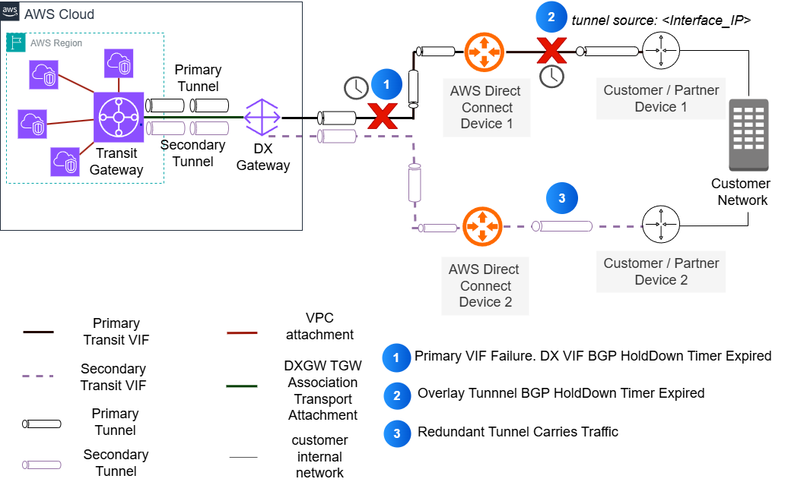

---
title: "Best Practices for Optimizing Failover Times for Overlay Tunnels over AWS Direct Connect"
date: 2025-08-21
weight: 3
chapter: false
pre: " <b> 3.3. </b> "
---

**Authors:** Pavlos Kaimakis and Azeem | **Date:** August 21, 2025

**Categories:** [AWS Direct Connect](https://aws.amazon.com/directconnect/), [AWS Site-to-Site VPN](https://aws.amazon.com/vpn/), [AWS Transit Gateway](https://aws.amazon.com/transit-gateway/)

---

## Introduction

Optimizing failover times in hybrid connectivity is critical for meeting Key Performance Indicators (KPIs) for availability in modern enterprise workloads. This is especially important when deploying overlay tunnels over Amazon Web Services (AWS) Direct Connect, such as AWS Site-to-Site VPN using IPSec tunnels, or Connect Attachments using Generic Routing Encapsulation (GRE) tunnels. Proper configuration can reduce failover times from minutes to milliseconds, significantly improving network reliability.

Following the 'Anticipate Failure' design principle from the Well-Architected Framework Operational Excellence pillar, this post outlines operational best practices to minimize downtime by up to 99% while maintaining resilient network connections between on-premises and AWS environments. For example, our analysis shows that simply choosing unpinned over pinned tunnel configurations can reduce failover times by up to 33%.

A resilient Direct Connect infrastructure creates the foundation for highly available hybrid connectivity. Before diving into overlay tunnel optimization, readers should familiarize themselves with the Direct Connect Resiliency Toolkit and understand Active/Active and Active/Passive configurations. This post uses the Direct Connect High Resiliency: Multi-Site non Redundant Deployment model as a reference architecture to illustrate these optimization techniques, as shown in the figure below.


_Figure 1: Direct Connect with High Resiliency Model_

---

## Key Factors Affecting Failover Times

When optimizing failover times for overlay tunnels over Direct Connect, there are two main factors to consider:

1. **Underlay connection failover speed**
2. **Overlay tunnel behavior**

First, we'll look at how to optimize BGP timers and implement BFD to improve Direct Connect failover detection and convergence at the underlay layer. Then, we'll explore how different tunnel configuration methods—pinned and unpinned—can significantly impact overall failover performance.

While optimizing BGP timers helps detect failures faster at the Direct Connect layer, the tunnel configuration strategy determines how quickly overlay traffic can recover through alternative paths. Understanding and implementing both factors is crucial for achieving optimal failover times in your hybrid network architecture.

### Virtual Interfaces (VIFs)

Direct Connect requires Virtual Interfaces (VIFs), which can be Public, Private, or Transit. Creating a Direct Connect VIF involves two main steps: exchanging VLAN tags and establishing Border Gateway Protocol (BGP) sessions. If you want to learn more about Direct Connect VIFs, you can refer to [our documentation](https://docs.aws.amazon.com/directconnect/).

In this post, we focus on two options:

* BGP hold timers
* Tunneling over Direct Connect

---

## BGP Timers and Their Impact on Failover Times

Direct Connect VIF failover times primarily depend on BGP failover timing. There are two main timer types to consider:

### BGP Hold Timer

This is the maximum time a BGP router waits to receive a keepalive or update message before declaring the peer dead and terminating the BGP session. On Direct Connect VIF, the default hold timer is 90 seconds, which can be reduced to a minimum of 3 seconds.

### BGP Keepalive Timer

This timer determines the interval at which a BGP router sends keepalive messages to peers to maintain the BGP session and signal active status. On Direct Connect VIF, the default keepalive timer is 30 seconds, which can be reduced to a minimum of 1 second.

To improve failover times, users can reduce BGP timers on their routers. AWS automatically negotiates to match these values when receiving BGP messages. However, BGP timers cannot be configured through the AWS Management Console.

**Important Note:** While reducing BGP timer values helps improve failover times, setting them too low is not recommended as it can affect network stability. Overly aggressive configuration can cause unnecessary BGP session resets during network congestion or CPU spikes. Each reset triggers route re-convergence, which can impact network stability and application traffic. This is especially important in environments with multiple BGP sessions where router resources need to be carefully managed.

---

## Bidirectional Forwarding Detection (BFD)

For faster failure detection and failover, we recommend enabling Bidirectional Forwarding Detection (BFD). Asynchronous BFD is automatically enabled for Direct Connect VIFs on the AWS side. However, you must configure your router to enable asynchronous BFD for your Direct Connect connection.

Below is a CLI configuration example illustrating how to enable BFD on a Cisco ASR 1002-HX running IOS-XE 16.1:

```
! Interface Configuration
interface TenGigabitEthernet1/0/0.100
description DX-VIF-1
encapsulation dot1q 100
ip address 169.254.100.1 255.255.255.252
bfd interval 300 min_rx 300 multiplier 3
no shutdown

! BGP Configuration
router bgp 65000
neighbor 169.254.100.2 remote-as 64512
neighbor 169.254.100.2 fall-over bfd
```

### Key BFD Components

**Minimum liveness detection interval:** This is the minimum interval between received BFD control packets that your router should expect. Shorter intervals allow faster failure detection but increase CPU usage. On Direct Connect, the minimum supported value is 300 msec.

**Minimum BFD multiplier:** This is the number of BFD packets that can be missed before a session is considered down. Total failure detection time is determined by multiplying this value by the detection interval. The minimum supported value is 3 (three).

### Effectiveness Comparison

Using BFD on Direct Connect VIFs significantly reduces failover times:

* **Without BFD:** BGP failover time = 3 seconds
* **With BFD:** Failover time = 3 × 300 ms = 0.9 seconds

This shows a **70% reduction** in failover time, making BFD a much more effective solution for failure detection and recovery.

---

## Tunneling over Direct Connect

Direct Connect acts as an underlay connection for users deploying overlay tunnels (Site-to-Site VPN or Connect Attachments) to Transit Gateway. While these overlay options provide advanced connectivity features, they also introduce protocol dependencies and timing factors that affect overall failover performance.

### Tunnel Configuration Methods

#### 1. Pinned Tunnels

In this configuration, the user-side tunnel outside IP addresses are routed exclusively through a specific Direct Connect VIF. This typically occurs when users use the Direct Connect VIF interface IP address as the tunnel outside IP address.



_Figure 2: Interface pinned overlay tunnels over Direct Connect_

**Configuration Example:**

```
! DX Interface Configuration
interface TenGigabitEthernet1/0/0.100
description DX-VIF-1
encapsulation dot1q 100
ip address 169.254.100.1 255.255.255.252
no shutdown

! BGP for DX VIF
router bgp 65000
bgp log-neighbor-changes
neighbor 169.254.100.2 remote-as 64512
!
address-family ipv4
! Important: Advertise VIF interface IP for tunnel endpoint reachability
network 169.254.100.1 mask 255.255.255.252
neighbor 169.254.100.2 activate
neighbor 169.254.100.2 route-map SET-LOCAL-PREF in
exit-address-family

! GRE Tunnel Configuration using DX VIF IP
interface Tunnel1
description TGW-Connect-Primary
ip address 172.16.1.1 255.255.255.252
tunnel source 169.254.100.1
tunnel destination 10.0.1.1
tunnel mode gre ip
no shutdown
```

**Impact of Pinned Tunnels:**

Pinning tunnels to a specific connection has important implications for failover:

* The tunnel is tied to a specific Direct Connect connection
* Traffic cannot immediately use backup paths in case of underlay failure
* Failover requires the tunnel BGP session to detect failure through BGP timer expiration
* Traffic only fails over after the tunnel is down
* This approach can lead to longer failover times

#### 2. Unpinned Tunnels

In this configuration, tunnel outside IP addresses originate from logical interfaces (such as loopbacks) configured on user routers. Both the AWS tunnel endpoint IP (Transit Gateway CIDR) and user router loopback IP addresses are reachable through all available Direct Connect VIFs.


_Figure 3: Unpinned overlay tunnels over Direct Connect_

**Traffic Engineering:**

* **On Public VIFs:** Use AS_PATH when advertising loopback routes
* **On Private/Transit VIFs:** Use BGP Local Preference communities when advertising loopback routes

**Configuration Example:**

```
! Loopback Interface Configuration
interface Loopback1
description Tunnel-Source-Interface
ip address 192.168.1.1 255.255.255.255
no shutdown

! GRE Tunnel Configuration
interface Tunnel1
description TGW-Connect
ip address 172.16.1.1 255.255.255.252
tunnel source Loopback1
tunnel destination 10.0.1.1
no shutdown

interface TenGigabitEthernet1/0/0.100
description DX-VIF-1
encapsulation dot1q 100
ip address 169.254.100.1 255.255.255.252
no shutdown

! BGP Configuration
router bgp 65000
bgp log-neighbor-changes
! DX VIF BGP
neighbor 169.254.100.2 remote-as 64512
!
address-family ipv4
! Important: Advertise loopback to DX VIF BGP
network 192.168.1.1 mask 255.255.255.255
! DX VIF neighbor - advertise loopback
neighbor 169.254.100.2 activate
neighbor 169.254.100.2 route-map SET-LOCAL-PREF in
neighbor 169.254.100.2 route-map ADVERTISE-LOOPBACK out
exit-address-family
```

---

## Failover Time Analysis

Different AWS tunneling services use different default BGP timer settings. We use Transit Gateway Connect attachments to compare failover times between pinned and unpinned configurations.

Transit Gateway Connect uses different BGP timers than Direct Connect VIFs:
* Keepalive timeout: 10 seconds
* Hold timer: 30 seconds

### Failover Time Comparison

As shown in the comparison table, while both pinned and unpinned configurations can achieve sub-second failover times with BFD, the implementation complexity differs significantly.

---

## Implementation Considerations

When implementing these failover optimization techniques, consider the following key aspects:

### Performance and Hardware

* Actual failover times may vary depending on router hardware capabilities and network complexity
* BFD configuration requires compatible hardware and proper planning for CPU and memory
* Consult your network equipment vendor documentation for specific convergence characteristics and recommended timer values

### Architectural Limitations

* While BFD significantly optimizes failover detection at the underlay layer, it can only be configured on Direct Connect VIF, not on overlay tunnels
* Remember that overlay tunnel headend failures still depend on tunnel BGP timers
* When applying very short timer values, note that BGP session instability and asymmetric routing can occur if not properly configured

### Deployment and Validation

Success depends on methodical deployment and continuous validation:

1. Start with conservative timer values and adjust gradually based on actual performance
2. Document baseline failover times before making changes
3. Apply optimizations step by step:
   * Start with BGP timers
   * Then enable BFD (if supported)
   * Finally implement your chosen tunnel configuration

Regular testing using Direct Connect failover tests and monitoring through Amazon CloudWatch metrics, along with tracking BFD and BGP status at the device level, will help ensure your configuration maintains optimal performance over time.

---

## Conclusion

This post illustrates how to optimize failover times for overlay tunnels over AWS Direct Connect. Our analysis shows:

* Pinned tunnel configurations with default timer values require more than **33%** longer to failover compared to unpinned tunnels
* The main reason is dependency on overlay BGP sessions
* Implementing BFD with unpinned tunnels allows reducing failover time from 90 seconds to approximately 300 milliseconds
* Achieving a **99%** improvement in recovery time

For users deploying overlay tunnels over Direct Connect, we recommend using unpinned tunnel configurations to minimize impact during failover. While this post focuses on underlay connection failures, the principles and configurations presented can help you build more reliable hybrid network architectures.

---

## About the Authors

**Azeem Ayaz**

Azeem is a Sr Network Specialist TAM at AWS Enterprise Support, specializing in supporting strategic enterprise customers and their complex cloud networking needs. With 13 years of experience in designing and operating network and security infrastructure, he focuses on building scalable architectures that help businesses optimize their cloud investments and achieve measurable business outcomes. Before joining AWS, Azeem developed his expertise at leading corporations including Vodafone, Cisco, and Juniper. When not busy designing cloud solutions, he enjoys playing strategy games and exploring new destinations with his partner.

**Pavlos Kaimakis**

Pavlos is a Senior Solutions Architect at AWS, where he helps customers design and deploy mission-critical enterprise solutions. With extensive experience in product development and customer support, he focuses on building scalable architectures that deliver real business value. Outside of work, Pavlos is an avid traveler who enjoys exploring new lands and cultures.

---

**Original Article Source:** [AWS Networking & Content Delivery Blog](https://aws.amazon.com/blogs/networking-and-content-delivery/)
