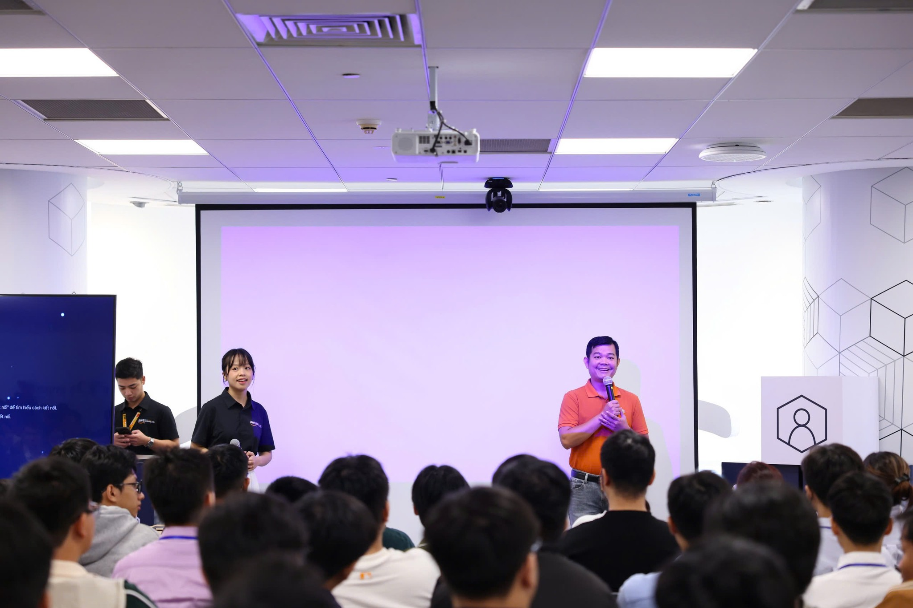
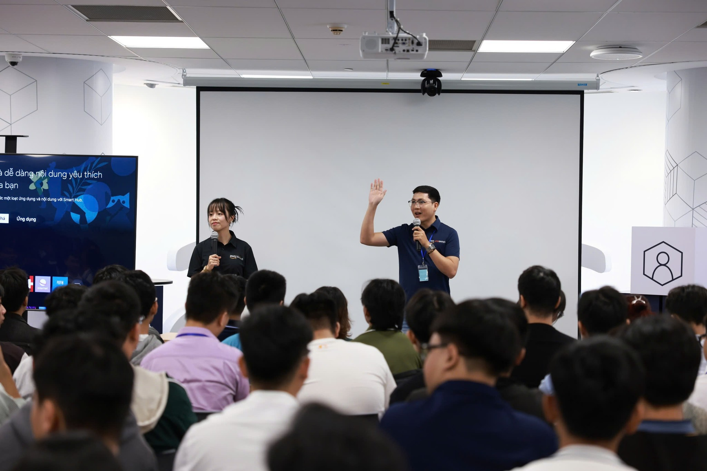

---
title: "Kick-off AWS FCJ Workforce"
date: 2025-09-06
weight: 1
chapter: false
pre: " <b> 4.1. </b> "
---

{}
⚠️ **Lưu ý:** Các thông tin dưới đây chỉ nhằm mục đích tham khảo, vui lòng **không sao chép nguyên văn** cho bài báo cáo của bạn kể cả warning này.
{}

# Báo cáo tóm tắt: "🎉 KICK-OFF AWS FIRST CLOUD JOURNEY WORKFORCE OJT FALL 2025 🎉"

### Mục tiêu sự kiện

- Xây dựng thế hệ AWS Builders chất lượng cao cho Việt Nam.

- Trang bị kỹ năng thực chiến về Cloud, DevOps, AI/ML, Security, và Data & Analytics cho sinh viên.

- Kết nối sinh viên với cộng đồng AWS Study Group 47,000+ thành viên và các doanh nghiệp đối tác AWS.

### Diễn giả

#### Từ Đại học FPT:

- **Thầy Nguyễn Trần Phước Bảo** – Trưởng phòng Quan hệ Doanh nghiệp

#### Từ AWS và Diễn giả khách mời:

- **Anh Nguyễn Gia Hưng** – Head of Solutions Architect, AWS Vietnam
- **Anh Đỗ Huy Thắng** – DevOps Lead, VNG
- **Anh Danh Hoàng Hiếu Nghị** – GenAI Engineer, Renova
- **Chị Bùi Hồ Linh Nhi** – AI Engineer, SoftwareOne
- **Anh Phạm Nguyễn Hải Anh** – Cloud Engineer, G-Asia Pacific
- **Anh Nguyễn Đồng Thanh Hiệp** – Principal Cloud Engineer, G-Asia Pacific

### Điểm nổi bật

#### Về Chương trình AWS First Cloud Journey Workforce

Khởi động từ năm 2021, chương trình đã đồng hành cùng hơn **2,000 sinh viên** trên khắp cả nước:

- Hơn **150 học viên** đã được đào tạo chuyên sâu và hiện đang làm việc tại các công ty công nghệ hàng đầu Việt Nam và quốc tế
- **Mục tiêu chính:**
  - Xây dựng thế hệ AWS Builders chất lượng cao cho Việt Nam
  - Trang bị kỹ năng thực chiến về Cloud, DevOps, AI/ML, Security, Data & Analytics
  - Kết nối sinh viên với cộng đồng AWS Study Group **47,000+ thành viên** và các doanh nghiệp đối tác AWS

Chương trình không chỉ là đào tạo công nghệ, mà còn là cầu nối quan trọng giữa tri thức – công nghệ – sự nghiệp, giúp sinh viên tự tin hòa nhập vào thế giới công nghệ hiện đại và hội nhập quốc tế.

#### Chương trình sự kiện

**📅 Thời gian:** 8h30 sáng, Thứ Bảy ngày 06/09/2025  
**📍 Địa điểm:** Tầng 26, Tòa nhà Bitexco Financial Tower, số 2 Hải Triều, P. Bến Nghé, Quận 1, TP.HCM

**8h30 – 9h00** | Đón tiếp & Check-in

- Networking & chụp hình lưu niệm

**9h00 – 9h15** | Khai mạc & Chào mừng

- Đại diện Nhà trường: Thầy Nguyễn Trần Phước Bảo – Trưởng phòng Quan hệ Doanh nghiệp

**Keynote & Industry Sharing**

**9h15 – 9h40** | AWS First Cloud Journey & Định hướng Tương lai  
👤 Nguyễn Gia Hưng – Head of Solutions Architect, AWS Vietnam

**9h40 – 10h05** | DevOps & Sự nghiệp tương lai  
👤 Đỗ Huy Thắng – DevOps Lead, VNG

**10h05 – 10h20** | Tea Break & Networking

**Alumni & Career Sharing**

**10h20 – 10h40** | Từ First Cloud Journey đến GenAI Engineer  
👤 Danh Hoàng Hiếu Nghị – GenAI Engineer, Renova

**10h40 – 11h00** | She in Tech & Hành trình cùng First Cloud Journey  
👤 Bùi Hồ Linh Nhi – AI Engineer, SoftwareOne

**11h00 – 11h20** | Một ngày làm Cloud Engineer  
👤 Phạm Nguyễn Hải Anh – Cloud Engineer, G-Asia Pacific

**11h20 – 11h40** | Hành trình đến với First Cloud Journey  
👤 Nguyễn Đồng Thanh Hiệp – Principal Cloud Engineer, G-Asia Pacific

### Những điểm chính rút ra

#### Từ AWS First Cloud Journey & Định hướng Tương lai (Nguyễn Gia Hưng)

- **Tác động của chương trình**: Hơn 2,000 sinh viên được đào tạo từ 2021, với 150+ đang làm việc tại các công ty công nghệ hàng đầu
- **Xu hướng Cloud Computing**: Hiểu về nhu cầu ngày càng tăng đối với các chuyên gia cloud tại Việt Nam
- **Hệ sinh thái AWS**: Tầm quan trọng của chứng chỉ AWS và kinh nghiệm thực tế trong phát triển sự nghiệp
- **Cơ hội tương lai**: Kỹ năng cloud mở ra nhiều con đường sự nghiệp (DevOps, AI/ML, Security, Data)

#### Từ DevOps & Sự nghiệp tương lai (Đỗ Huy Thắng - VNG)

- **Văn hóa DevOps**: Cách các thực tiễn DevOps đang chuyển đổi phát triển phần mềm quy mô lớn
- **Nhu cầu ngành**: Những gì các công ty như VNG tìm kiếm ở các chuyên gia cloud và DevOps
- **Phát triển sự nghiệp**: Con đường từ DevOps junior đến senior
- **Kỹ năng thực tế**: Tầm quan trọng của CI/CD, automation, và infrastructure as code

#### Từ Câu chuyện thành công của Alumni

**Danh Hoàng Hiếu Nghị (GenAI Engineer, Renova)**

- Hành trình từ sinh viên First Cloud Journey đến làm việc với công nghệ GenAI tiên tiến
- Nền tảng từ chương trình giúp chuyển đổi sang vai trò AI/ML như thế nào
- Ứng dụng thực tế của kỹ năng cloud trong các dự án GenAI

**Bùi Hồ Linh Nhi (AI Engineer, SoftwareOne)**

- She in Tech: Phá vỡ rào cản và thành công trong sự nghiệp công nghệ
- Cân bằng giữa kỹ năng kỹ thuật với kỹ năng mềm và học tập liên tục
- First Cloud Journey cung cấp sự tự tin và hỗ trợ cộng đồng như thế nào

**Phạm Nguyễn Hải Anh (Cloud Engineer, G-Asia Pacific)**

- Một ngày điển hình làm việc với vai trò Cloud Engineer tại công ty quốc tế
- Thách thức kỹ thuật và giải quyết vấn đề trong môi trường production
- Cân bằng công việc-cuộc sống và sự hài lòng trong nghề cloud

**Nguyễn Đồng Thanh Hiệp (Principal Cloud Engineer, G-Asia Pacific)**

- Tiến trình sự nghiệp từ sinh viên đến Principal Engineer
- Các cột mốc quan trọng và kinh nghiệm học tập trên hành trình
- Lời khuyên cho sinh viên bắt đầu con đường sự nghiệp cloud

### Áp dụng vào Phát triển Sự nghiệp

- **Bắt đầu với Nền tảng**: Xây dựng nền tảng vững chắc về các dịch vụ AWS cốt lõi và khái niệm cloud
- **Lấy Chứng chỉ**: Theo đuổi các chứng chỉ AWS (Cloud Practitioner → Associate → Professional)
- **Tham gia Cộng đồng**: Tích cực tham gia AWS Study Group (47,000+ thành viên) để networking và học hỏi
- **Thực hành Thực tế**: Làm việc trên các dự án thực tế, đóng góp cho open source, xây dựng portfolio
- **Học hỏi từ Alumni**: Kết nối với các cựu học viên để được mentorship và hướng dẫn sự nghiệp
- **Phát triển Kỹ năng Mềm**: Giao tiếp, làm việc nhóm, và kỹ năng thuyết trình cũng quan trọng không kém
- **Luôn Tò mò**: Theo dõi xu hướng ngành về Cloud, DevOps, AI/ML, và các công nghệ mới nổi
- **Networking Tích cực**: Tham dự sự kiện, kết nối với chuyên gia, xây dựng mối quan hệ có ý nghĩa

### Trải nghiệm Sự kiện

Tham dự sự kiện **"KICK-OFF AWS FIRST CLOUD JOURNEY WORKFORCE OJT FALL 2025"** là một trải nghiệm vô cùng truyền cảm hứng và động lực. Sự kiện cung cấp những hiểu biết quý giá về ngành công nghiệp cloud computing và cơ hội nghề nghiệp. Những trải nghiệm chính bao gồm:

#### Cảm hứng từ Các Nhà Lãnh đạo Ngành

- Được nghe trực tiếp từ **AWS Solutions Architects** về tương lai của công nghệ cloud tại Việt Nam
- Học về **thực tiễn DevOps** từ DevOps Lead của VNG và hiểu cách nó định hình phát triển phần mềm hiện đại
- Có được cái nhìn sâu sắc về **tầm quan trọng chiến lược** của kỹ năng cloud trong thị trường việc làm hiện nay

#### Câu chuyện Thành công của Alumni

- **Hành trình GenAI Engineer**: Hiểu con đường từ sinh viên đến làm việc với công nghệ AI tiên tiến
- **Góc nhìn She in Tech**: Những câu chuyện truyền cảm hứng cho thấy sự nghiệp công nghệ dành cho tất cả mọi người
- **Kinh nghiệm thực tế**: Học về một ngày điển hình của Cloud Engineers tại các công ty quốc tế
- **Tiến trình sự nghiệp**: Thấy được các ví dụ cụ thể về cách chương trình dẫn đến sự nghiệp có ý nghĩa

#### Hiểu về Chương trình

- Học về **chương trình đào tạo toàn diện** bao gồm Cloud, DevOps, AI/ML, Security, và Data & Analytics
- Hiểu về **sự hỗ trợ cộng đồng** có sẵn thông qua 47,000+ thành viên AWS Study Group
- Khám phá **con đường sự nghiệp** và kết nối với các công ty công nghệ hàng đầu
- Nhận ra tầm quan trọng của **đào tạo thực hành** và kinh nghiệm thực tế

#### Cơ hội Networking

- Kết nối với **các bạn tham gia** có cùng mục tiêu sự nghiệp
- Gặp gỡ **alumni** cung cấp lời khuyên và mentorship quý giá
- Trao đổi liên lạc với **các chuyên gia ngành** để được hướng dẫn trong tương lai
- Xây dựng mối quan hệ sẽ hỗ trợ hành trình học tập của mình

#### Động lực Cá nhân

- Có được **sự rõ ràng** về định hướng sự nghiệp trong cloud computing
- Cảm thấy **được truyền cảm hứng** bởi những câu chuyện thành công của alumni xuất phát từ vị trí tương tự
- Hiểu được **giá trị** của việc đầu tư thời gian học công nghệ AWS
- Phát triển **sự tự tin** rằng với sự cống hiến, mình có thể đạt được thành công tương tự

#### Một Số Hình Ảnh Sự Kiện

---

---

---

---

---

---

---

> Nhìn chung, sự kiện KICK-OFF là một trải nghiệm đầy cảm hứng, mang lại cho mình động lực mạnh mẽ để tự tin bước vào con đường sự nghiệp trong ngành công nghệ. Những hiểu biết từ các chuyên gia và alumni đã mở ra tầm nhìn mới, giúp mình hiểu rõ hơn về cách xây dựng hệ thống hiện đại và làm việc hiệu quả trong môi trường chuyên nghiệp. Mình mong chờ được áp dụng những kiến thức này vào học tập và các dự án tương lai.
