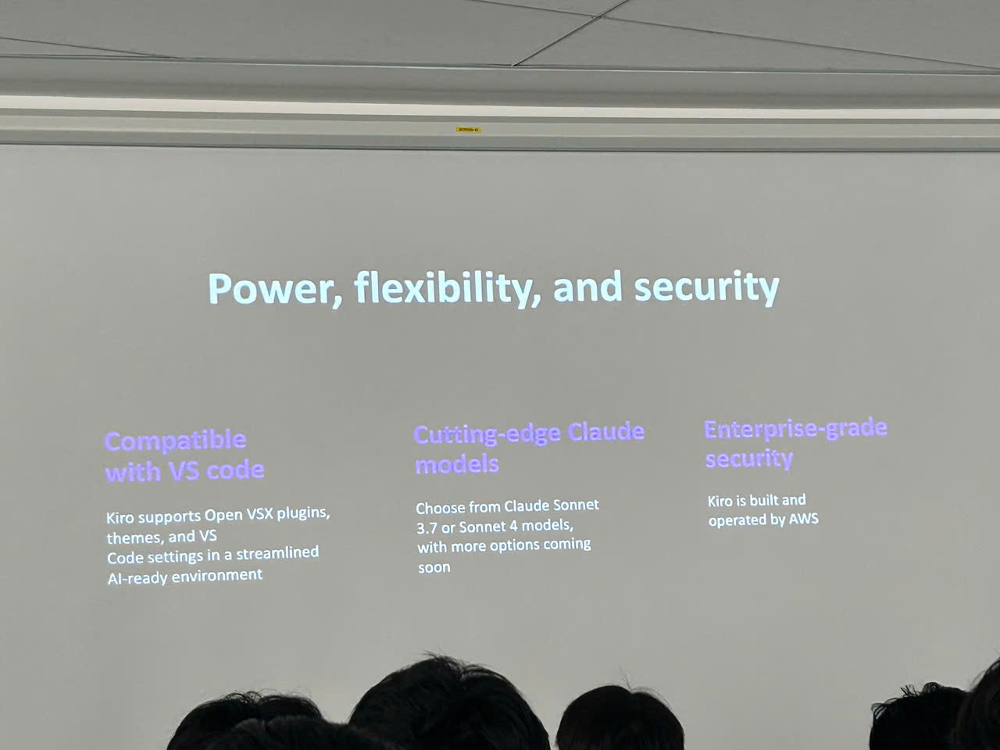
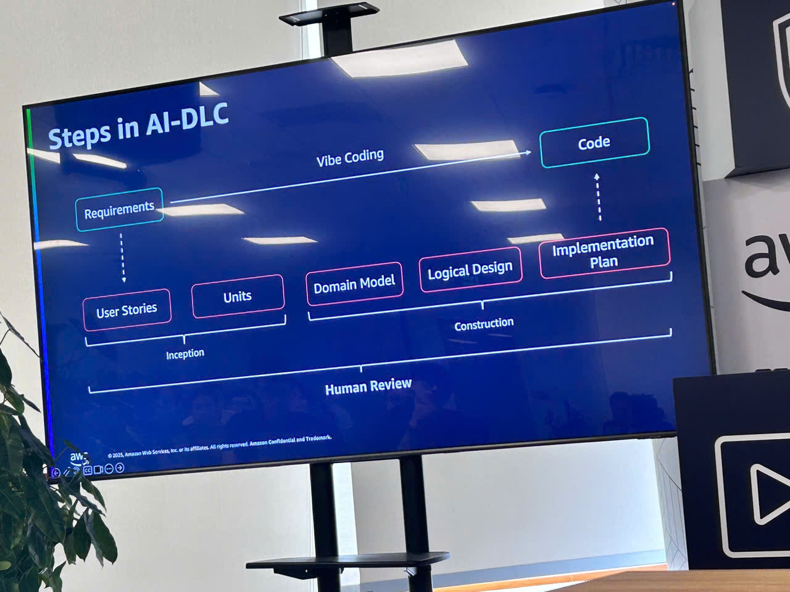
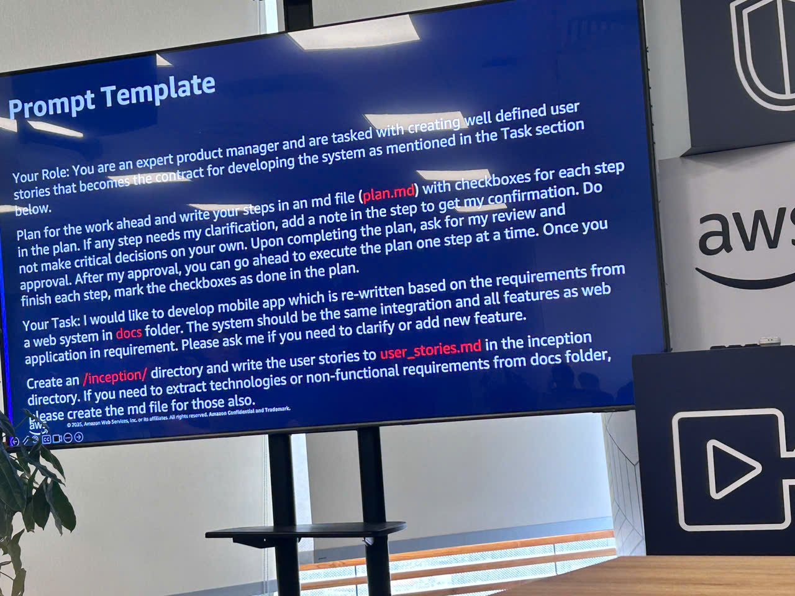
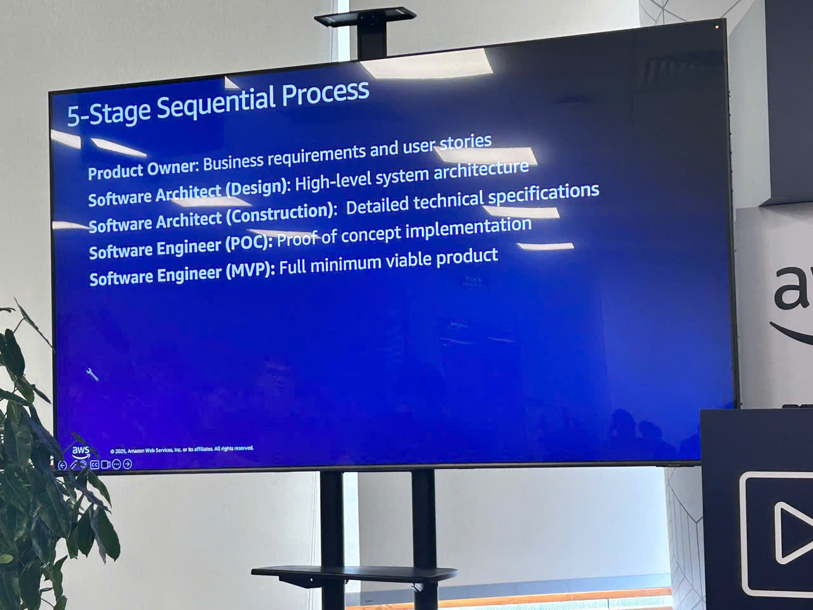
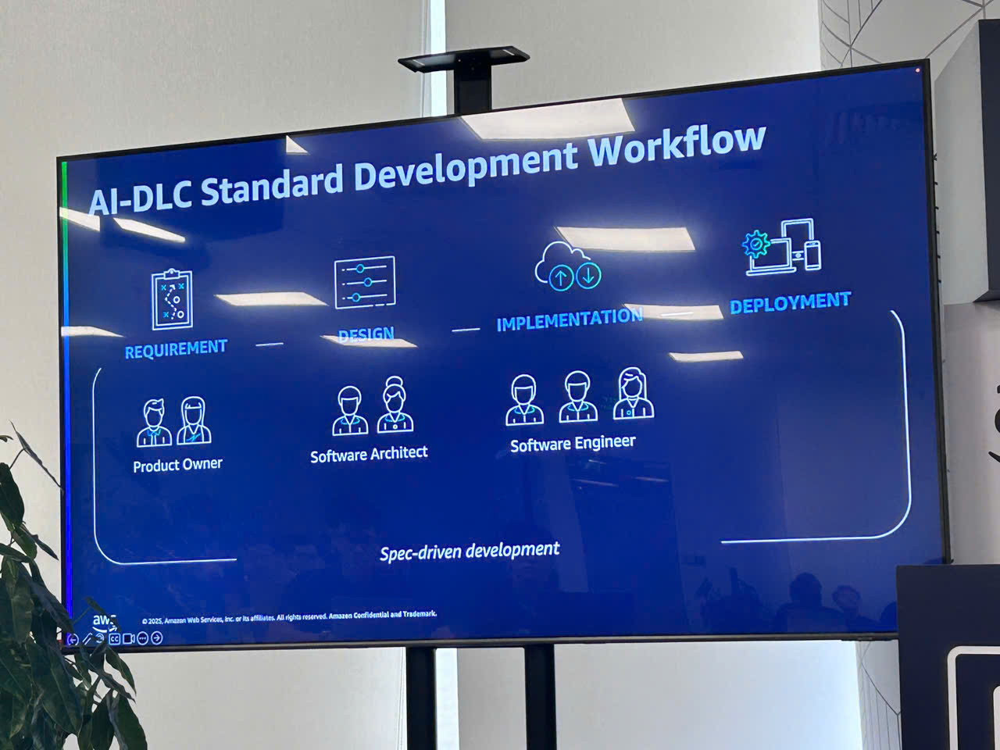
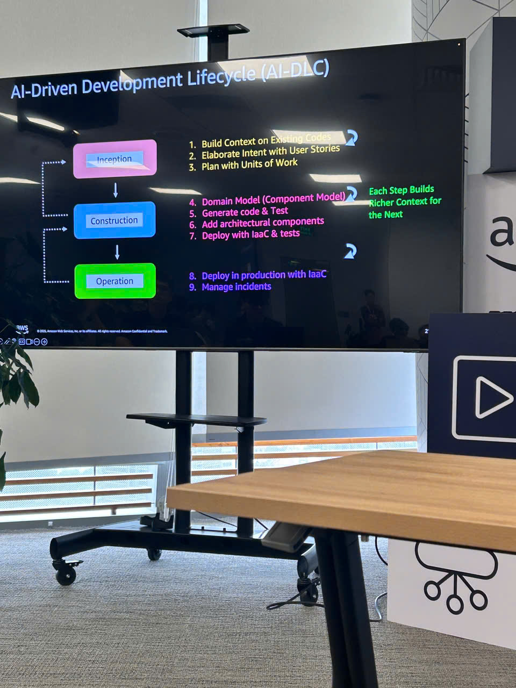
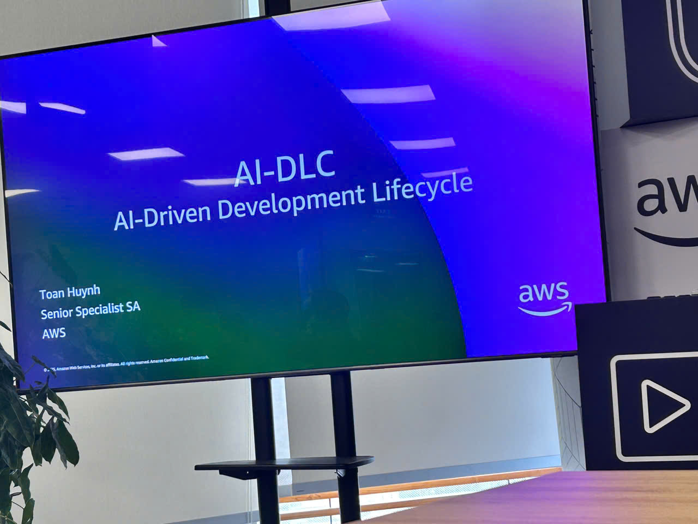

---
title: "Chu Trình Phát Triển Phần Mềm Dựa Trên AI: Tái Tưởng Tượng Kỹ Thuật Phần Mềm"
date: 2025-10-03
weight: 1
chapter: false
pre: " <b> 4.2. </b> "
---

{}
⚠️ **Lưu ý:** Thông tin dưới đây chỉ mang tính chất tham khảo. Vui lòng **không sao chép nguyên văn** vào báo cáo của bạn, bao gồm cả cảnh báo này.
{}

# Báo Cáo Tóm Tắt: "Chu Trình Phát Triển Phần Mềm Dựa Trên AI: Tái Tưởng Tượng Kỹ Thuật Phần Mềm"

### Mục Tiêu Sự Kiện

- Khám phá cách AI tạo sinh biến đổi chu trình phát triển phần mềm
- Trình diễn tích hợp AI từ kiến trúc đến phát triển, kiểm thử, triển khai và bảo trì
- Cho thấy cách AI tự động hóa các tác vụ nặng nhọc không tạo sự khác biệt để tăng năng suất
- Giúp các nhà phát triển tập trung vào các nhiệm vụ sáng tạo có giá trị cao hơn thông qua phát triển dựa trên AI

### Thông Tin Sự Kiện

- **Địa điểm**: AWS Event Hall, L26 Tòa nhà Bitexco, TP.HCM
- **Ngày & Giờ**: 2:00 chiều, Thứ Sáu, ngày 3 tháng 10 năm 2025

### Diễn Giả & Điều Phối Viên

**Giảng viên:**

- **Toàn Huỳnh** – Senior Specialist SA, AWS – Tổng quan về Chu trình Phát triển dựa trên AI và trình diễn Amazon Q Developer
- **My Nguyễn** – Sr. Prototyping Architect, Amazon Web Services - ASEAN – Trình diễn Kiro

**Điều phối viên:**

- **Diễm My**
- **Đại Trường**
- **Đình Nguyên**

### Chương Trình Sự Kiện

#### 2:00 chiều - 2:15 chiều: Chào Mừng

- Phát biểu khai mạc và giới thiệu về AWS GenAI Builder Club
- Tổng quan về mục tiêu của buổi học

#### 2:15 chiều - 3:30 chiều: Tổng Quan Chu Trình Phát Triển Dựa Trên AI và Trình Diễn Amazon Q Developer

**Trình bày bởi Toàn Huỳnh**

- **AI Đang Làm Đảo Lộn Phát Triển Phần Mềm**: Cách AI tạo sinh đang chuyển đổi căn bản bối cảnh phát triển phần mềm
- **AI Trong Phát Triển - Các Kết Quả Đạt Được**: Hiểu các lợi ích chính mà AI mang lại cho đội ngũ phát triển:
  - **Tốc Độ (Velocity)**: Thời gian cần thiết để đưa một ý tưởng ra thị trường
  - **Chất Lượng (Quality)**: Ứng dụng, sản phẩm hoặc dịch vụ đáp ứng kỳ vọng của thị trường về khả năng sử dụng, độ tin cậy, v.v.
  - **Khả Năng Đáp Ứng Thị Trường (Market Responsiveness)**: Khả năng xoay chuyển nhanh chóng để đáp ứng nhu cầu thị trường luôn thay đổi
  - **Khả Năng Dự Đoán (Predictability)**: Các nhóm duy trì nhịp độ phân phối có thể dự đoán được, cho phép doanh nghiệp đưa ra quyết định kịp thời có cơ sở
  - **Đổi Mới (Innovation)**: Ý tưởng mới, suy nghĩ sáng tạo hoặc tưởng tượng mới lạ cung cấp giải pháp tốt hơn để đáp ứng yêu cầu mới, nhu cầu chưa được nêu rõ hoặc nhu cầu thị trường đã biết
  - **Sự Gắn Kết Của Nhà Phát Triển (Developer Engagement)**: Các nhà phát triển đầu tư nhiều hơn vào công việc của họ, sẵn sàng nỗ lực thêm, đam mê với mục đích công việc và cam kết với tổ chức
  - **Cải Tiến Liên Tục (Continuous Improvement)**: Khả năng của tổ chức không ngừng theo đuổi tối ưu hóa trong tất cả các khía cạnh của chức năng phát triển
  - **Sự Hài Lòng Của Khách Hàng (Customer Satisfaction)**: Khách hàng hài lòng với trải nghiệm, lợi ích và kết quả khi sử dụng ứng dụng hoặc dịch vụ
  - **Năng Suất (Productivity)**: Tăng giá trị kinh doanh đạt được trong khi duy trì hoặc giảm chi phí
- **Thách Thức Với Phát Triển AI**: Giải quyết các trở ngại chính:
  - **Mở Rộng Quy Mô Phát Triển AI**: Công cụ mã hóa AI xuất sắc ở các tác vụ nhỏ nhưng có thể thất bại với các dự án phức tạp
  - **Kiểm Soát Hạn Chế**: Các công cụ hiện có khiến việc cộng tác và quản lý các agent trở nên khó khăn
  - **Kiểm Soát Chất Lượng**: Đưa một dự án từ proof-of-concept đến production trong khi duy trì kiểm soát chất lượng trở nên ngày càng khó khăn
- **Tính Năng Amazon Q Developer**:
  - Tạo và hoàn thiện mã nguồn
  - Hỗ trợ lập kế hoạch kiến trúc
  - Tự động hóa kiểm thử
  - Tối ưu hóa triển khai
  - Hỗ trợ bảo mật và bảo trì
- **Trình Diễn Trực Tiếp**: Các trường hợp sử dụng thực tế và tăng năng suất

#### 3:30 chiều - 3:45 chiều: Giải Lao

- Giao lưu và giải khát

#### 3:45 chiều - 4:30 chiều: Trình Diễn Kiro

**Trình bày bởi My Nguyễn**

- **Giới Thiệu Về Kiro**: IDE và trợ lý phát triển được hỗ trợ bởi AI
- **Khả Năng Chính**:
  - Hỗ trợ mã nguồn thông minh
  - Tính năng phát triển tự động
  - Tích hợp với quy trình phát triển
  - Công cụ cộng tác và năng suất
- **Trình Diễn Trực Tiếp**: Ví dụ thực hành về phát triển dựa trên AI
- **Phiên Hỏi Đáp**: Thảo luận tương tác với người tham dự

### Điểm Chính Rút Ra

#### Mô Hình Phát Triển Dựa Trên AI

- **Sự Thay Đổi Mang Tính Chuyển Đổi**: AI tạo sinh thay đổi căn bản cách các nhà phát triển làm việc trong toàn bộ SDLC
- **Chín Kết Quả Chính**: Phát triển dựa trên AI mang lại cải thiện có thể đo lường được trên tốc độ, chất lượng, khả năng đáp ứng thị trường, khả năng dự đoán, đổi mới, sự gắn kết của nhà phát triển, cải tiến liên tục, sự hài lòng của khách hàng và năng suất
- **Giải Quyết Các Thách Thức Thực Tế**: Hiểu và vượt qua các thách thức về mở rộng quy mô phát triển AI, duy trì kiểm soát và đảm bảo chất lượng từ ý tưởng đến sản xuất
- **Tích Hợp Đầu Cuối**: AI hỗ trợ từ lập kế hoạch ban đầu đến triển khai và bảo trì
- **Tăng Tốc Học Tập**: Công cụ AI giúp các nhà phát triển học các công nghệ và mẫu mới nhanh hơn

#### Khả Năng Của Amazon Q Developer

- **Tạo Mã Nguồn Thông Minh**: Gợi ý và hoàn thiện mã nguồn nhận biết ngữ cảnh
- **Hỗ Trợ Kiến Trúc**: Khuyến nghị thiết kế và thực hành tốt nhất được hỗ trợ bởi AI
- **Tự Động Hóa Kiểm Thử**: Tạo test tự động và cải thiện độ bao phủ
- **Tích Hợp Bảo Mật**: Quét bảo mật tích hợp sẵn và phát hiện lỗ hổng
- **Tối Ưu Hóa Triển Khai**: CI/CD được tối ưu hóa với khuyến nghị từ AI

#### Kiro Như Đối Tác Phát Triển

- **IDE Được Hỗ Trợ Bởi AI**: Tích hợp liền mạch AI vào môi trường phát triển
- **Tính Năng Tự Động**: Khả năng làm việc độc lập trên các nhiệm vụ được xác định
- **Hiểu Biết Ngữ Cảnh**: Hiểu sâu về codebase và cấu trúc dự án
- **Nâng Cao Quy Trình**: Tích hợp tự nhiên với các quy trình phát triển hiện có
- **Trí Tuệ Cộng Tác**: Làm việc cùng các nhà phát triển như một đối tác thực sự

#### Triển Khai Thực Tế

- **Bắt Đầu Nhỏ**: Bắt đầu với các trường hợp sử dụng cụ thể để xây dựng sự tự tin
- **Đo Lường Tác Động**: Theo dõi tăng năng suất và cải thiện chất lượng
- **Lặp Lại và Học Hỏi**: Liên tục tinh chỉnh tích hợp AI dựa trên kết quả
- **Áp Dụng Trong Nhóm**: Khuyến khích thử nghiệm và chia sẻ kiến thức

### Áp Dụng Vào Công Việc

- **Tích Hợp Amazon Q Developer**: Bắt đầu sử dụng hỗ trợ AI cho việc tạo và xem xét mã nguồn
- **Áp Dụng Kiro**: Thử nghiệm các tính năng IDE được hỗ trợ bởi AI trong phát triển hàng ngày
- **Tự Động Hóa Các Tác Vụ Lặp Đi Lặp Lại**: Xác định và ủy thác công việc không tạo sự khác biệt cho công cụ AI
- **Nâng Cao Chất Lượng Mã Nguồn**: Tận dụng AI cho kiểm thử, quét bảo mật và thực hành tốt nhất
- **Tăng Tốc Học Tập**: Sử dụng AI để khám phá các framework, ngôn ngữ và mẫu mới
- **Tối Ưu Hóa Quy Trình**: Tích hợp công cụ AI vào các pipeline CI/CD hiện có
- **Chia Sẻ Kiến Thức**: Ghi chép các thực hành phát triển dựa trên AI với nhóm

### Trải Nghiệm Sự Kiện

Tham dự buổi **"Chu Trình Phát Triển Phần Mềm Dựa Trên AI: Tái Tưởng Tượng Kỹ Thuật Phần Mềm"** tại AWS GenAI Builder Club là một trải nghiệm mở mang tầm mắt, thể hiện sức mạnh chuyển đổi của AI tạo sinh trong phát triển phần mềm. Các trải nghiệm chính bao gồm:

#### Học Hỏi Từ Các Chuyên Gia AWS

- **Toàn Huỳnh** cung cấp những hiểu biết toàn diện về cách AI đang cách mạng hóa toàn bộ chu trình phát triển phần mềm.
- **My Nguyễn** trình diễn các ứng dụng thực tế của Kiro, cho thấy cách AI có thể là một đối tác phát triển thực sự.
- Các ví dụ thực tế minh họa tăng năng suất và cải thiện chất lượng có thể đạt được với công cụ AI.

#### Trình Diễn Thực Hành

- Chứng kiến **Amazon Q Developer** hoạt động, tạo mã nguồn, đề xuất cải thiện kiến trúc và tự động hóa kiểm thử.
- Thấy cách **Kiro** tích hợp liền mạch vào quy trình phát triển, cung cấp hỗ trợ thông minh ở mọi bước.
- Học các kỹ thuật thực tế để kết hợp AI vào các nhiệm vụ phát triển hàng ngày mà không làm gián đoạn các quy trình hiện có.

#### Hiểu Biết Về Khả Năng AI

- Khám phá cách AI có thể **tự động hóa công việc nặng nhọc không tạo sự khác biệt**, giải phóng các nhà phát triển để tập trung vào giải quyết vấn đề sáng tạo.
- Khám phá toàn bộ phổ hỗ trợ AI: từ lập kế hoạch và kiến trúc đến triển khai và bảo trì.
- Hiểu tầm quan trọng của **AI nhận biết ngữ cảnh** hiểu cấu trúc dự án và mẫu mã hóa.

#### Giao Lưu và Xây Dựng Cộng Đồng

- Kết nối với các nhà phát triển đồng nghiệp từ **AWS GenAI Builder Club** cũng đang khám phá phát triển dựa trên AI.
- Trao đổi ý tưởng về các chiến lược áp dụng AI thực tế và thách thức.
- Xây dựng mối quan hệ với các chuyên gia và điều phối viên AWS để được hỗ trợ và học hỏi liên tục.

#### Hiểu Biết Thực Tế Thu Được

- Công cụ AI không phải là sự thay thế mà là **nhân tố nhân năng suất** nâng cao khả năng của nhà phát triển.
- Bắt đầu với **các trường hợp sử dụng cụ thể** hiệu quả hơn là cố gắng áp dụng AI ở mọi nơi cùng một lúc.
- **Đo lường tác động** thông qua các chỉ số năng suất giúp biện minh và tinh chỉnh việc áp dụng công cụ AI.
- Tương lai của phát triển phần mềm là **trí tuệ cộng tác** giữa con người và AI.

#### Các Bước Tiếp Theo

- Bắt đầu thử nghiệm với **Amazon Q Developer** trong các dự án hiện tại để trải nghiệm trực tiếp lợi ích năng suất.
- Khám phá **Kiro** để được hỗ trợ phát triển tự động hơn trong các nhiệm vụ thường ngày.
- Chia sẻ những gì học được với nhóm và ủng hộ việc áp dụng công cụ AI khi thích hợp.
- Tiếp tục tham gia với cộng đồng **AWS GenAI Builder Club** để học hỏi và hỗ trợ liên tục.

#### Một Số Hình Ảnh Sự Kiện

---

---

---

---

---

---

---

---

---

---

---

> Nhìn chung, buổi học này đã thay đổi căn bản quan điểm của tôi về phát triển phần mềm. Các trình diễn cho thấy rằng phát triển dựa trên AI không phải là một khái niệm tương lai xa vời mà là một thực tế thực tiễn có sẵn ngày hôm nay. Chìa khóa là bắt đầu thử nghiệm, đo lường kết quả và liên tục tinh chỉnh cách chúng ta tích hợp AI vào quy trình làm việc của mình.
