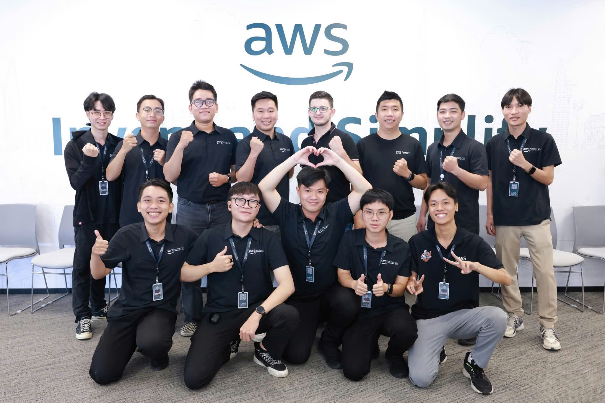
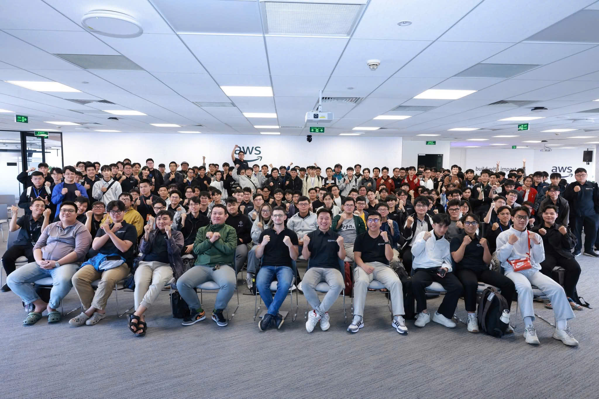
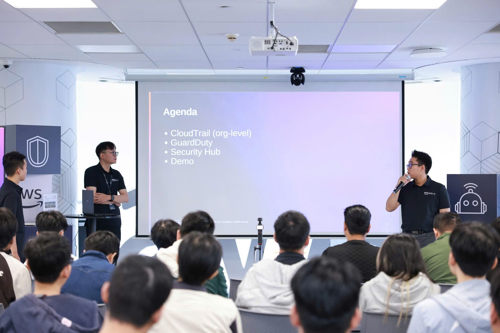
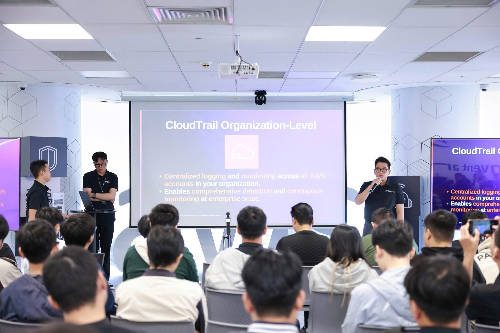
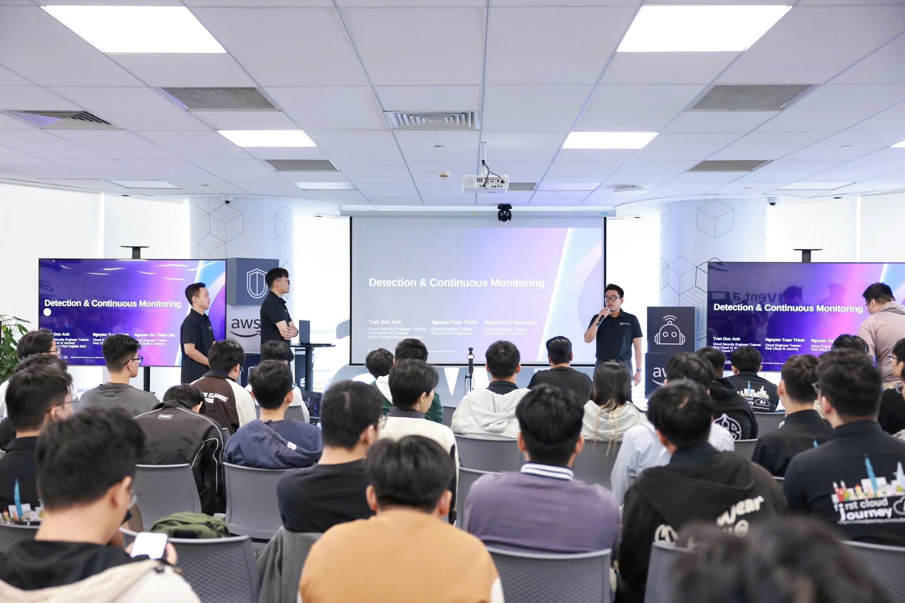
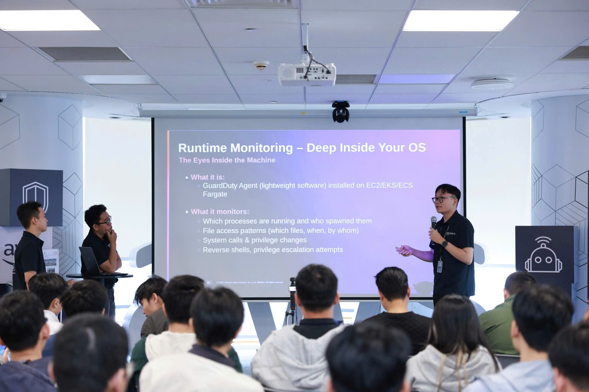

{}
⚠️ **Note:** The information below is for reference purposes only. Please **do not copy it verbatim** into your report, including this warning.
{}

# Summary Report: "AWS Cloud Mastery Series #3 - Security Pillar"

### Event Objectives

- Understand AWS Well-Architected Security Pillar fundamentals
- Learn Identity and Access Management (IAM) best practices
- Explore detection and continuous monitoring services
- Master infrastructure and network protection strategies
- Understand data protection with encryption and key management
- Learn incident response procedures and automation

### Event Details

- **Location**: Bitexco Financial Tower, Quận 1, Thành phố Hồ Chí Minh
- **Date & Time**: 8:30 AM – 12:00 PM, Saturday, November 29, 2025

### Speakers & Facilitators

**Speakers:**

- **Le Vu Xuan An** – AWS Cloud Club Captain HCMUTE, First Cloud AI Journey
- **Tran Duc Anh** – AWS Cloud Club Captain SGU, First Cloud AI Journey
- **Tran Doan Cong Ly** – AWS Cloud Club Captain PTIT, First Cloud AI Journey
- **Danh Hoang Hieu Nghi** – AWS Cloud Club Captain HUFLIT, First Cloud AI Journey

**Coordinators:**

- **AWS Cloud Club Vietnam**
- **First Cloud Journey Program Team**

### Event Agenda

#### 8:30 – 8:50 AM: Opening & Security Foundation

- Registration and welcome
- Introduction to AWS Well-Architected Framework
- **Security Pillar Overview**:
  - Role of Security Pillar in Well-Architected Framework
  - Core principles: Least Privilege, Zero Trust, Defense in Depth
  - **Shared Responsibility Model**: Understanding AWS vs customer responsibilities
  - Top security threats in cloud environments in Vietnam
- Setting expectations for the morning session

#### 8:50 – 9:30 AM: Pillar 1 — Identity & Access Management

- **IAM Fundamentals**:
  - **IAM Users**: Individual identities for people accessing AWS
  - **IAM Groups**: Collections of users with similar permissions
  - **IAM Roles**: Temporary credentials for services and applications
  - **IAM Policies**: JSON documents defining permissions
  - Avoiding long-term credentials and access keys
- **IAM Best Practices**:
  - **Principle of Least Privilege**: Grant only necessary permissions
  - **Multi-Factor Authentication (MFA)**: Adding extra security layer
  - **Password Policies**: Enforcing strong passwords
  - **Credential Rotation**: Regularly updating access keys
- **IAM Identity Center (AWS SSO)**:
  - Centralized access management for multiple AWS accounts
  - Single Sign-On (SSO) for simplified user experience
  - Permission sets for consistent access control
- **Advanced IAM Concepts**:
  - **Service Control Policies (SCP)**: Organization-wide permission boundaries
  - **Permission Boundaries**: Maximum permissions for IAM entities
  - **IAM Access Analyzer**: Identifying unintended access to resources
- **Mini Demo**: Validating IAM policies and simulating access scenarios

#### 9:30 – 9:55 AM: Pillar 2 — Detection

- **AWS CloudTrail**:
  - **What is CloudTrail**: Records API calls and user activity
  - **Organization-level trails**: Centralized logging across accounts
  - **Use cases**: Compliance auditing, security analysis, troubleshooting
  - **Log file integrity validation**: Ensuring logs haven't been tampered with
- **Amazon GuardDuty**:
  - **Intelligent threat detection**: ML-powered security monitoring
  - **Threat types**: Unauthorized access, compromised instances, reconnaissance
  - **Findings and severity levels**: Understanding and prioritizing alerts
  - **Integration with EventBridge**: Automated response to threats
- **AWS Security Hub**:
  - **Centralized security view**: Aggregating findings from multiple services
  - **Security standards**: CIS AWS Foundations, PCI DSS compliance checks
  - **Automated compliance checks**: Continuous monitoring of security posture
- **Logging at Every Layer**:
  - **VPC Flow Logs**: Network traffic monitoring
  - **Application Load Balancer (ALB) logs**: HTTP/HTTPS request logging
  - **S3 access logs**: Tracking bucket access
- **Alerting and Automation**:
  - **Amazon EventBridge**: Event-driven automation
  - **Detection-as-Code**: Infrastructure and security rules as code

#### 9:55 – 10:10 AM: Coffee Break

- Networking and refreshments
- Q&A with speakers

#### 10:10 – 10:40 AM: Pillar 3 — Infrastructure Protection

- **VPC Network Security**:
  - **VPC Segmentation**: Isolating resources with subnets
  - **Public vs Private Subnets**: When to use each
  - **Internet Gateway and NAT Gateway**: Controlling internet access
  - **VPC Peering and Transit Gateway**: Connecting VPCs securely
- **Security Groups vs Network ACLs**:
  - **Security Groups**: Stateful firewall at instance level
  - **Network ACLs**: Stateless firewall at subnet level
  - **Best practices**: When to use each and how to combine them
  - **Common patterns**: Layered security approach
- **AWS WAF (Web Application Firewall)**:
  - **Protection against common web exploits**: SQL injection, XSS
  - **Managed rules**: Pre-configured rule sets
  - **Custom rules**: Tailored protection for your applications
  - **Rate limiting**: Preventing DDoS attacks
- **AWS Shield**:
  - **Shield Standard**: Automatic DDoS protection (free)
  - **Shield Advanced**: Enhanced DDoS protection with 24/7 support
- **AWS Network Firewall**:
  - **Stateful inspection**: Deep packet inspection
  - **Intrusion prevention**: Blocking malicious traffic
- **Workload Protection Basics**:
  - **EC2 security**: Instance hardening and patching
  - **ECS/EKS security**: Container security best practices

#### 10:40 – 11:10 AM: Pillar 4 — Data Protection

- **AWS Key Management Service (KMS)**:
  - **What is KMS**: Managed service for encryption keys
  - **Customer Master Keys (CMKs)**: AWS-managed vs customer-managed
  - **Key policies**: Controlling who can use keys
  - **Grants**: Temporary permissions for key usage
  - **Automatic key rotation**: Enhancing security over time
- **Encryption at Rest**:
  - **Amazon S3**: Server-side encryption (SSE-S3, SSE-KMS, SSE-C)
  - **Amazon EBS**: Encrypted volumes for EC2 instances
  - **Amazon RDS**: Database encryption with KMS
  - **Amazon DynamoDB**: Encryption by default
- **Encryption in Transit**:
  - **TLS/SSL**: Securing data in motion
  - **VPN connections**: Encrypted tunnels to AWS
  - **AWS Certificate Manager (ACM)**: Managing SSL/TLS certificates
- **Secrets Management**:
  - **AWS Secrets Manager**: Storing and rotating secrets automatically
  - **AWS Systems Manager Parameter Store**: Storing configuration and secrets
  - **Rotation patterns**: Best practices for credential rotation
- **Data Classification and Access Control**:
  - **Amazon Macie**: Discovering and protecting sensitive data
  - **S3 bucket policies**: Fine-grained access control
  - **Access guardrails**: Preventing accidental data exposure

#### 11:10 – 11:40 AM: Pillar 5 — Incident Response

- **Incident Response Lifecycle**:
  - **Preparation**: Planning and tooling
  - **Detection**: Identifying security incidents
  - **Analysis**: Understanding the scope and impact
  - **Containment**: Limiting damage
  - **Eradication**: Removing threats
  - **Recovery**: Restoring normal operations
  - **Post-incident activity**: Learning and improving
- **Common Incident Playbooks**:
  - **Compromised IAM key**:
    - Immediate key deactivation
    - Reviewing CloudTrail logs for unauthorized actions
    - Rotating credentials and notifying affected parties
  - **S3 bucket public exposure**:
    - Identifying exposed data
    - Removing public access
    - Investigating how exposure occurred
    - Implementing preventive controls
  - **EC2 instance malware detection**:
    - Isolating infected instance
    - Creating forensic snapshot
    - Analyzing malware behavior
    - Rebuilding clean instance
- **Evidence Collection**:
  - **EBS snapshots**: Preserving disk state for analysis
  - **Memory dumps**: Capturing runtime state
  - **Log preservation**: Ensuring logs aren't deleted
- **Automated Incident Response**:
  - **AWS Lambda**: Serverless response functions
  - **AWS Step Functions**: Orchestrating complex response workflows
  - **EventBridge integration**: Triggering automated responses
  - **Example automation**: Auto-isolating compromised instances

#### 11:40 – 12:00 PM: Wrap-Up & Q&A

- **Summary of 5 Security Pillars**:
  - Identity & Access Management
  - Detection
  - Infrastructure Protection
  - Data Protection
  - Incident Response
- **Common Security Pitfalls**:
  - Overly permissive IAM policies
  - Lack of monitoring and alerting
  - Unencrypted data
  - No incident response plan
- **Real-world Scenarios in Vietnamese Enterprises**:
  - Multi-account strategy for large organizations
  - Compliance requirements (GDPR, local regulations)
  - Cost-effective security implementations
- **Security Learning Roadmap**:
  - AWS Certified Cloud Practitioner (CLF-C02)
  - AWS Certified Solutions Architect Associate (SAA-C03)
  - AWS Certified Security Specialty
  - AWS Certified Solutions Architect Professional
- **Open Q&A Session**: Interactive discussion with all speakers

### Key Takeaways

#### Security Foundation

- **Well-Architected Security Pillar**: Framework for building secure cloud architectures
- **Shared Responsibility Model**: AWS secures the cloud, customers secure in the cloud
- **Core Principles**: Least Privilege, Zero Trust, Defense in Depth
- **Security is everyone's responsibility**: Not just the security team's job

#### Identity & Access Management

- **IAM is the foundation**: Proper IAM configuration is critical for security
- **Avoid long-term credentials**: Use roles and temporary credentials whenever possible
- **MFA everywhere**: Enable MFA for all users, especially privileged accounts
- **Least Privilege**: Grant only the permissions needed to perform a task
- **IAM Identity Center**: Simplifies multi-account access management
- **Regular audits**: Use IAM Access Analyzer to identify unintended access

#### Detection and Monitoring

- **CloudTrail**: Essential for audit trails and compliance
- **GuardDuty**: Intelligent threat detection without managing infrastructure
- **Security Hub**: Centralized view of security posture across accounts
- **Logging is critical**: Enable logging at every layer (VPC, ALB, S3, etc.)
- **Automate responses**: Use EventBridge to trigger automated remediation
- **Detection-as-Code**: Treat security rules like infrastructure code

#### Infrastructure Protection

- **Network segmentation**: Use VPCs and subnets to isolate resources
- **Security Groups and NACLs**: Layered security approach
- **WAF for web applications**: Protect against common exploits
- **Shield for DDoS**: Automatic protection with Shield Standard
- **Private by default**: Place resources in private subnets unless they need internet access
- **Workload hardening**: Keep instances patched and follow security best practices

#### Data Protection

- **Encryption everywhere**: At rest and in transit
- **KMS for key management**: Centralized control over encryption keys
- **Secrets Manager**: Never hardcode credentials in code
- **Automatic rotation**: Regularly rotate keys and secrets
- **Data classification**: Know what data you have and where it is
- **Access controls**: Use bucket policies and IAM to control data access

#### Incident Response

- **Have a plan**: Prepare incident response playbooks before incidents occur
- **Automate responses**: Use Lambda and Step Functions for common scenarios
- **Preserve evidence**: Take snapshots and preserve logs for forensic analysis
- **Isolate quickly**: Contain threats to prevent spread
- **Learn and improve**: Conduct post-incident reviews to strengthen defenses
- **Practice regularly**: Run tabletop exercises and simulations

### Applying to Work

- **Audit IAM policies**: Review and tighten permissions following least privilege
- **Enable CloudTrail**: Ensure organization-wide logging is enabled
- **Turn on GuardDuty**: Start monitoring for threats immediately
- **Encrypt data**: Enable encryption for S3, EBS, RDS, and other services
- **Use Secrets Manager**: Migrate hardcoded credentials to Secrets Manager
- **Create incident playbooks**: Document response procedures for common scenarios
- **Implement MFA**: Require MFA for all users, especially administrators
- **Regular security reviews**: Schedule periodic security assessments
- **Study for certifications**: Work towards AWS Security Specialty certification

### Event Experience

Attending the **"AWS Cloud Mastery Series #3 - Security Pillar"** was an enriching morning session that provided foundational knowledge of AWS security best practices aligned with the Well-Architected Framework. As someone learning AWS fundamentals (C01, C02, C03 level), this event was perfectly tailored to build a strong security foundation. Key experiences included:

#### Learning from AWS Cloud Club Captains

- **Student leaders** from top universities shared practical security knowledge in an accessible way
- **Real-world examples** from Vietnamese enterprises made concepts relatable and applicable
- **Beginner-friendly explanations** helped demystify complex security topics
- **Interactive Q&A** allowed clarification of fundamental concepts
- Speakers emphasized security best practices relevant to certification exams

#### Understanding Security Fundamentals

- Gained clear understanding of the **Shared Responsibility Model** and what customers must secure
- Learned the importance of **Least Privilege** principle in IAM policy design
- Understood how **Defense in Depth** creates multiple layers of security
- Discovered common security threats facing organizations in Vietnam
- Realized that security is not just technical but also about processes and culture

#### IAM Best Practices

- Learned why **long-term access keys are risky** and how to avoid them
- Understood the difference between **IAM users, groups, roles, and policies**
- Discovered how **MFA adds critical protection** to accounts
- Explored **IAM Identity Center** for managing multi-account access
- Saw practical examples of **policy validation** and access simulation
- Understood **Service Control Policies** for organization-wide governance

#### Detection and Monitoring Services

- Learned how **CloudTrail** records all API activity for audit and compliance
- Discovered **GuardDuty's** intelligent threat detection capabilities
- Understood **Security Hub** as a centralized security dashboard
- Explored the importance of **VPC Flow Logs** for network monitoring
- Learned about **EventBridge** for automated security responses
- Realized that logging must be enabled at every layer of the architecture

#### Network and Infrastructure Security

- Understood **VPC segmentation** and the difference between public and private subnets
- Learned when to use **Security Groups vs Network ACLs**
- Discovered **AWS WAF** for protecting web applications from common attacks
- Explored **AWS Shield** for DDoS protection
- Understood the concept of **defense in depth** with layered security controls
- Learned basic **EC2 and container security** best practices

#### Data Protection Essentials

- Gained understanding of **AWS KMS** and encryption key management
- Learned about **encryption at rest** for S3, EBS, RDS, and DynamoDB
- Understood **encryption in transit** with TLS/SSL
- Discovered **Secrets Manager** for secure credential storage and rotation
- Explored **AWS Certificate Manager** for managing SSL/TLS certificates
- Learned about **Amazon Macie** for discovering sensitive data

#### Incident Response Preparation

- Understood the **incident response lifecycle** from detection to recovery
- Learned practical **playbooks** for common security incidents:
  - Responding to compromised IAM credentials
  - Handling accidentally exposed S3 buckets
  - Dealing with malware-infected EC2 instances
- Discovered how to **preserve evidence** with snapshots and logs
- Explored **automated response** using Lambda and Step Functions
- Realized the importance of **preparation and practice** before incidents occur

#### Networking and Community Building

- Connected with fellow AWS learners and cloud enthusiasts
- Exchanged experiences about AWS certification preparation
- Built relationships with AWS Cloud Club members for ongoing support
- Joined the First Cloud Journey community for continuous learning
- Discovered study resources and practice materials for AWS certifications

#### Practical Insights for Beginners

- **Security is foundational**: Must be considered from day one, not added later
- **Start with IAM**: Proper identity and access management is the first line of defense
- **Enable logging early**: CloudTrail and GuardDuty should be turned on immediately
- **Encrypt by default**: Modern AWS services make encryption easy to enable
- **Automate where possible**: Use managed services to reduce security burden
- **Keep learning**: Security is constantly evolving, continuous education is essential

#### Certification Preparation Insights

- Many topics covered align directly with **AWS Certified Cloud Practitioner (CLF-C02)**
- Security concepts are heavily tested in **AWS Certified Solutions Architect Associate (SAA-C03)**
- Understanding these fundamentals prepares for **AWS Certified Security Specialty**
- Speakers shared tips for remembering key concepts for exams
- Real-world scenarios help reinforce theoretical knowledge

#### Next Steps

- Review **IAM best practices** and implement MFA on personal AWS accounts
- Enable **CloudTrail and GuardDuty** in practice accounts
- Practice creating **Security Groups and NACLs** with proper rules
- Experiment with **KMS encryption** for S3 and EBS
- Study **incident response playbooks** for common scenarios
- Continue preparing for **AWS certifications** with focus on security
- Join **AWS Cloud Club** study groups for collaborative learning
- Practice with **AWS Free Tier** to gain hands-on experience

> Overall, this morning session provided an excellent introduction to AWS security fundamentals through the lens of the Well-Architected Security Pillar. The content was perfectly suited for beginners learning AWS basics, with clear explanations and practical examples. The five pillars—Identity & Access Management, Detection, Infrastructure Protection, Data Protection, and Incident Response—provide a comprehensive framework for thinking about cloud security. The key takeaway is that security must be built into every layer of cloud architecture from the beginning, and AWS provides the tools and services to make this achievable even for those just starting their cloud journey.

### Event Pictures

---

---

---

---

---

